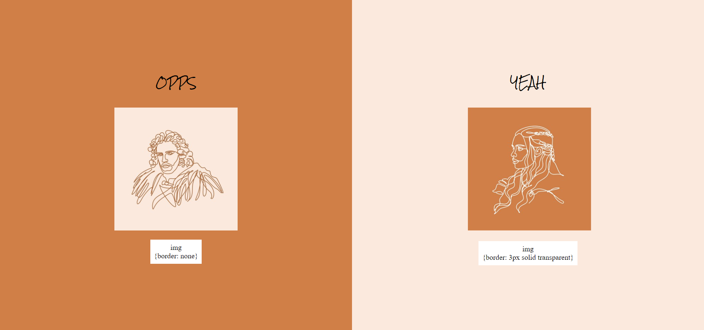
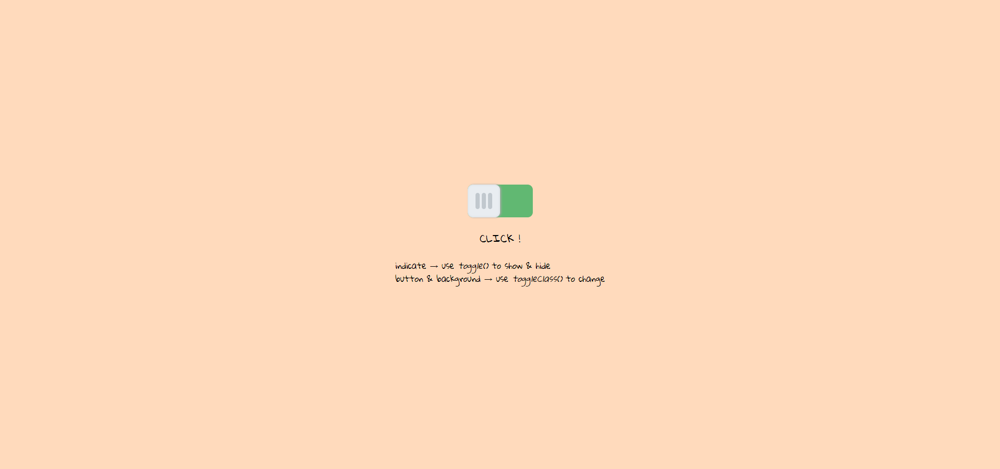
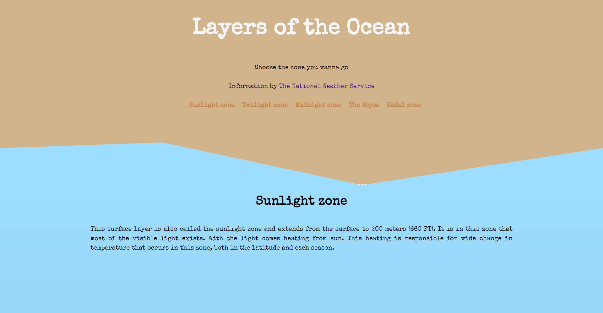

## 使用 hover 產生圖片外框（border）時會使其位移
> 在想要有 hover 的圖片先預設透明的框線，hover 過去後則不會改變圖片的寬度  
對應檔案：`Q1-image-moves-on-hover.html`  

 
 

## 使用 .toggle() 切換狀態
> 在 jQuery 1.9以上版本，toggle() ，無法用 [callback function](https://expect7.pixnet.net/blog/post/38296922)，僅能做到顯示與隱藏。如果想要進行特定的樣式切換，可以透過 toggleClass() 增加或移除 class 以達到效果。  
對應檔案：`Q2-jQuery-toggle.html`  

 
 

## 切換背景圖時會產生閃現或抖動
> 預先加載好圖片並至合適尺寸

 
 

## 點擊後將頁面滾動到特定區塊　
> 對應檔案：`Q5-scroll-to-the-particular-block.html`  

 
 　
